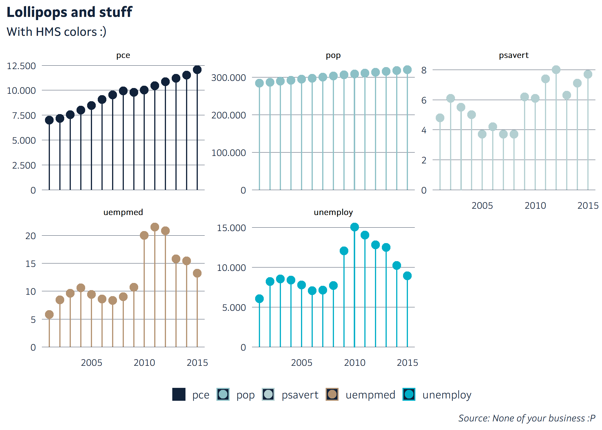

<!-- README.md is generated from README.Rmd. Please edit that file -->

# HMSr

<!-- badges: start -->

<!-- badges: end -->

**NOTE: MOST OF THE FUNCTION HAVE NO PRACTICAL USE OUTSIDE
[HMS](https://www.hms.is/)**

This pacake will include:

  - **Graphical theme**
  - **Common helper functions**
      - Tidy seasonal adjustment with X13
  - **Tools for getting and handling data from the datawarehouse**
  - **functions to get external data**

## Installation

You can install the development version from
[GitHub](https://github.com/) with:

``` r
# install.packages("devtools")
remotes::install_github("karsfri/HMSr")
```

## Theme

The default template in ggplot2 is readable, but ugly:

``` r
library(tidyverse)
library(patchwork)
library(lubridate)
library(HMSr)
data("economics")

economics %>%
  filter(date == lubridate::floor_date(date, "year"), year(date) > 2000) %>%
  gather(var, val, -date) %>%
  ggplot(aes(date, val, color = var)) +
  geom_col(width = 0.3) +
  geom_point() +
  labs(
    title = "Lollipops and stuff",
    subtitle = "With HMS colors",
    x = NULL,
    y = NULL,
    caption = "Source: None of your business :P"
  ) +
  facet_wrap(~var, scales = "free_y")
```


The `theme_set_hms()` function sets `theme_hms` as the default theme,
along with default colors for some of the more popular geoms.

Notice also the helper function, `label_isl()`.

``` r
theme_set_hms()

economics %>%
  filter(date == lubridate::floor_date(date, "year"), year(date) > 2000) %>%
  gather(var, val, -date) %>%
  ggplot(aes(date, val, color = var)) +
  geom_col(width = 0.3) +
  geom_point() +
  theme_hms() +
  scale_color_manual(values = palette_dark) +
  scale_y_continuous(labels = label_isl()) +
  labs(
    title = "Lollipops and stuff",
    subtitle = "With HMS colors",
    x = NULL,
    y = NULL,
    caption = "Source: None of your business :P"
  ) +
  facet_wrap(~var, scales = "free_y")
```



### Caption strings

Strengir fyrir algengar heimildir:

``` r
c(
  cap_hms,
  cap_hagstofa,
  cap_hms_hagstofa,
  cap_thjodskra,
  cap_hms_thjodskra,
  cap_sedlo,
  cap_hms_sedlo
) %>% 
  knitr::kable()
```

| x                                           |
| :------------------------------------------ |
| Heimild: Hagdeild HMS                       |
| Heimild: Hagstofa Íslands                   |
| Heimild: Hagstofa Íslands og hagdeild HMS   |
| Heimild: Þjóðskrá Íslands                   |
| Heimild: Þjóðskrá Íslands og hagdeild HMS   |
| Heimild: Seðlabanki Íslands                 |
| Heimild: Seðlabanki Íslands og hagdeild HMS |

## Seasonal adjustment

TBD

## Dates

The lubriyear converts numeric vector containing years to a date
variable at January first of the corrisponding year:

``` r
x <- tibble(year = 2010:2017)

x %>% 
  mutate(timi = lubriyear(year)) %>% 
  knitr::kable()
```

| year | timi       |
| ---: | :--------- |
| 2010 | 2010-01-01 |
| 2011 | 2011-01-01 |
| 2012 | 2012-01-01 |
| 2013 | 2013-01-01 |
| 2014 | 2014-01-01 |
| 2015 | 2015-01-01 |
| 2016 | 2016-01-01 |
| 2017 | 2017-01-01 |

It also has optional argument, month:

``` r
x %>% 
  mutate(
    month = rep_len(rep(1:12), 8),
    timi = lubriyear(year, month)
    )
```

    ## # A tibble: 8 x 3
    ##    year month timi      
    ##   <int> <int> <date>    
    ## 1  2010     1 2010-01-01
    ## 2  2011     2 2011-02-01
    ## 3  2012     3 2012-03-01
    ## 4  2013     4 2013-04-01
    ## 5  2014     5 2014-05-01
    ## 6  2015     6 2015-06-01
    ## 7  2016     7 2016-07-01
    ## 8  2017     8 2017-08-01

lubriYYYYMM works the same, but is made specially for the MMMMYY
variable from the datawarehouse:

``` r
lubriYYYYMM("2017M03") %>% 
  knitr::kable()
```

| x          |
| :--------- |
| 2017-03-01 |
