<!-- README.md is generated from README.Rmd. Please edit that file -->

# HMSr

<!-- badges: start -->

<!-- badges: end -->

**NOTE: MOST OF THE FUNCTION HAVE NO PRACTICAL USE OUTSIDE
[HMS](https://www.hms.is/)**

This pacake will include:

  - **Graphical theme**
  - **Common helper functions**
      - Tidy seasonal adjustment with X13
  - **Tools for getting and handling data from the datawarehouse**
  - **functions to get external data**

## Installation

**NOTE: MIGHT NOT WORK IN MAC BECAUSE OF THE FOLLOWING CODE IN theme.R**

``` r
# Load fonts
  # grDevices::windowsFonts(Setimo = windowsFont("Setimo"))
  # grDevices::windowsFonts(SetimoLight = windowsFont("Setimo Light"))
```

You can install the development version from
[GitHub](https://github.com/) with:

``` r
# install.packages("devtools")
remotes::install_github("karsfri/HMSr")
```

## Theme

**NOTE:** color palette will improve\! Waiting for more colors

The default template in ggplot2 is readable, but ugly:

``` r
library(tidyverse)
library(patchwork)
library(lubridate)
library(HMSr)
data("economics")

economics %>%
  filter(date == lubridate::floor_date(date, "year"), year(date) > 2000) %>%
  gather(var, val, -date) %>%
  ggplot(aes(date, val, color = var)) +
  geom_col(width = 0.3) +
  geom_point() +
  labs(
    title = "Lollipops and stuff",
    subtitle = "With default colors :(",
    x = NULL,
    y = NULL,
    caption = "Source: None of your business :P"
  ) +
  facet_wrap(~var, scales = "free_y")
```


The `theme_set_hms()` function sets `theme_hms` as the default theme,
along with default colors for some of the more popular geoms.

Notice also the helper function, `label_isl()`.

``` r
theme_set_hms()

economics %>%
  filter(date == lubridate::floor_date(date, "year"), year(date) > 2000) %>%
  gather(var, val, -date) %>%
  ggplot(aes(date, val, color = var)) +
  geom_col(width = 0.3) +
  geom_point() +
  theme_hms() +
  scale_color_manual(values = palette_dark) +
  scale_y_continuous(labels = label_isl()) +
  labs(
    title = "Lollipops and stuff",
    subtitle = "With HMS colors :)",
    x = NULL,
    y = NULL,
    caption = "Source: None of your business :P"
  ) +
  facet_wrap(~var, scales = "free_y")
```


``` r
  economics %>%
    filter(date == floor_date(date, "year"), year(date) > 2000) %>%
    gather(var, val, -date) %>%
    ggplot(aes(date, val, fill = var)) +
    geom_col() +
    theme_hms() +
    scale_color_manual(values = palette_dark) +
    scale_y_continuous(labels = label_isl()) +
    labs(
      title = "Bars and stuff",
      subtitle = "With HMS colors",
      x = NULL,
      y = NULL,
      caption = "Source: None of your business :P"
    ) +
    facet_wrap(~var, scales = "free_y")
```

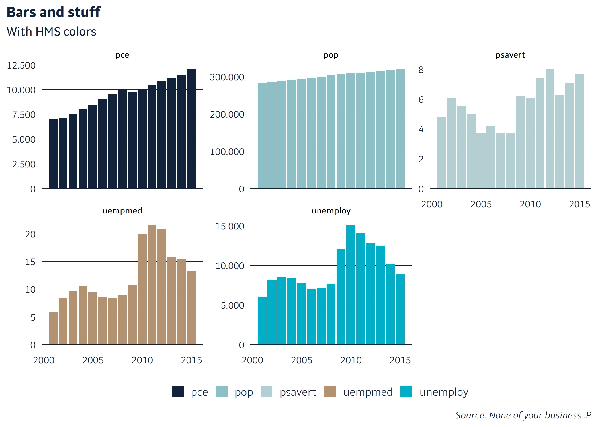

``` r
  economics %>%
    filter(date == floor_date(date, "year"), year(date) > 2000) %>%
    gather(var, val, -date) %>%
    ggplot(aes(date, val, fill = var, color = var)) +
    geom_area(alpha = 0.5, color = NA) +
    geom_line() +
    theme_hms() +
    scale_color_manual(values = palette_dark) +
    scale_y_continuous(labels = label_isl()) +
    labs(
      title = "Area and stuff",
      subtitle = "With HMS colors",
      x = NULL,
      y = NULL,
      caption = "Source: None of your business :P"
    ) +
    facet_wrap(~var, scales = "free_y")
```

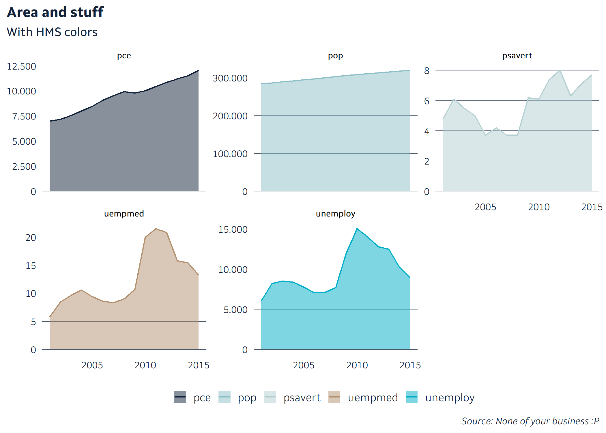

### Palettes

**WAITING FOR PERMANENT PALETTES**

### Labels

There are four functions to control the labels of the y-axis and the
x-axis. They use comma as a decimal mark and point as a grouping mark.
Usually they are used inside `scale_y_continous()` eða
`scale_x_continous`, en hér eru þau sýnd inní demo\_continous sem sýnir
bara einn ás.

``` r
scales::demo_continuous(c(0, 1000000), labels = label_isk()) 
```

    ## scale_x_continuous(labels = label_isk())

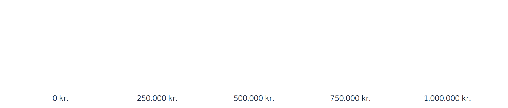

``` r
scales::demo_continuous(c(0, 1000000), labels = label_isl())
```

    ## scale_x_continuous(labels = label_isl())


``` r
scales::demo_continuous(c(0, 1), labels = label_percent_isl(accuracy = 0.1))
```

    ## scale_x_continuous(labels = label_percent_isl(accuracy = 0.1))

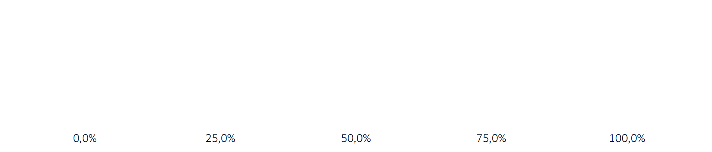

### Caption strings

Strings for common sources to put in caption (for use for the caption
argument in `labs()`):

``` r
c(
cap_hms,
cap_hagstofa,
cap_hms_hagstofa,
cap_thjodskra,
cap_hms_thjodskra,
cap_sedlo,
cap_hms_sedlo
) %>% 
knitr::kable()
```

| x                                           |
| :------------------------------------------ |
| Heimild: Hagdeild HMS                       |
| Heimild: Hagstofa Íslands                   |
| Heimild: Hagstofa Íslands og hagdeild HMS   |
| Heimild: Þjóðskrá Íslands                   |
| Heimild: Þjóðskrá Íslands og hagdeild HMS   |
| Heimild: Seðlabanki Íslands                 |
| Heimild: Seðlabanki Íslands og hagdeild HMS |

## save functions

The functions `ggsave_png`, `ggsave_svg` and `ggsave_both` are thin
wrappers around `ggsave`, with default resolution and size set. There
are two commonly used length and width parameters in *HMS* documents,
and those are provided as objects and they have the following values in
cm:

``` r
c(
  width_narrow,
  width_wide,
  height_regular,
  height_full
) %>% 
  knitr::kable()
```

|    x |
| ---: |
|  8.5 |
| 18.0 |
|  9.0 |
| 20.0 |

## Seasonal adjustment

*NOT READY*

Group of functions that make X13-ARIMA seasonal adjustment easier on the
fly.

  - `seas_seasonally_adjusted()`
  - `seas_trend()`
  - `seas_seasonal_components()`
  - `seas_irregular()`
  - `seas_irregular()`

<!-- end list -->

``` r
trade <- read_hagstofan_alt("https://px.hagstofa.is:443/pxis/sq/8ad42406-35c1-442b-a556-1498992b56ed")
```

The
[data](https://px.hagstofa.is/pxis/pxweb/is/Efnahagur/Efnahagur__utanrikisverslun__1_voruvidskipti__01_voruskipti/UTA06002.px/table/tableViewLayout1/?rxid=8966fb9b-6a92-41b6-8758-129d490bb573)
is different components of international trade:

``` r
trade %>%
  mutate(Mánuður = lubriYYYYMM(Mánuður)) %>%
  ################# Magic :) #################################################
  mutate(
    `Útflutningur fob - Árstíðarleiðrétt` = seas_seasonally_adjusted(`Útflutningur fob`, Mánuður)
    ) %>%
  ##############################################################################
  select(Mánuður, `Útflutningur fob`, `Útflutningur fob - Árstíðarleiðrétt` ) %>%
  gather(var, val, -Mánuður) %>%
  ggplot(aes(Mánuður, val, color = var)) +
  geom_line()
```


the trend component:

``` r
trade %>%
  mutate(Mánuður = lubriYYYYMM(Mánuður)) %>%
  ################# Magic :) #################################################
  mutate(
    `Útflutningur fob - Trend` = seas_trend(`Útflutningur fob`, Mánuður)
    ) %>%
  ##############################################################################
  select(Mánuður, `Útflutningur fob`,  `Útflutningur fob - Trend` ) %>%
  gather(var, val, -Mánuður) %>%
  ggplot(aes(Mánuður, val, color = var)) +
  geom_line()
```

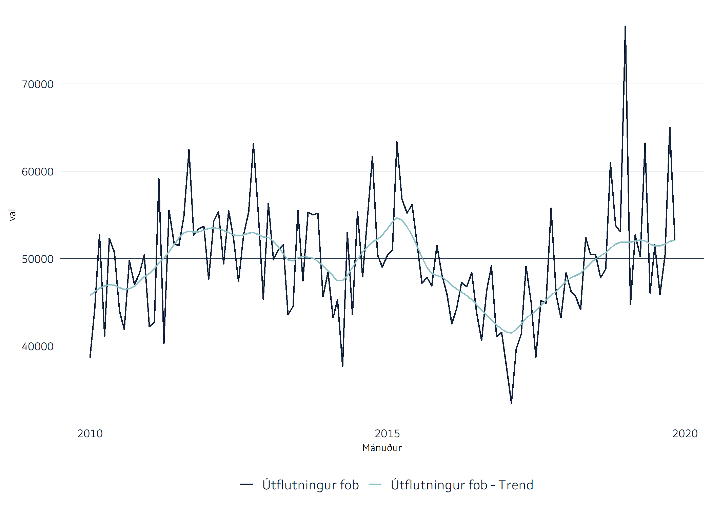

### Many groups

``` r
trade_long <- trade %>%
  mutate(Mánuður = lubriYYYYMM(Mánuður)) %>%
  gather(variable, value, -Mánuður) 

trade_long %>% 
  head() %>% 
  knitr::kable()
```

| Mánuður    | variable         |   value |
| :--------- | :--------------- | ------: |
| 2010-01-01 | Útflutningur fob | 38605.1 |
| 2010-02-01 | Útflutningur fob | 44266.3 |
| 2010-03-01 | Útflutningur fob | 52763.7 |
| 2010-04-01 | Útflutningur fob | 41095.7 |
| 2010-05-01 | Útflutningur fob | 52311.9 |
| 2010-06-01 | Útflutningur fob | 50671.3 |

If the data is in a *long* format or *tidy* format, make sure to group
the variables in such a way that all the dates are distinct within each
group:

``` r
trade_long %>% 
  group_by(variable) %>% 
  mutate(trend = seas_trend(value, Mánuður)) %>% 
  ggplot(aes(Mánuður, trend, color = variable)) +
  geom_line()
```


Failing to do so will result in an error:

``` r
trade_long %>% 
  # group_by(variable) %>% 
  mutate(trend = seas_trend(value, Mánuður)) %>% 
  ggplot(aes(Mánuður, trend, color = variable)) +
  geom_line()
```

    ## Error in tidy_seas(x = x, date = date, frequency = frequency, ...): length(date) == length(unique(date)) is not TRUE

It is possible to get all the different components from the
`seasonal::seas()` function with `map_seas()` but it’s

still *experimental*. It might result in unexpected behaviour if the
data structure is different from this example.

``` r
trade_seas <- trade_long %>% 
  group_by(variable) %>% 
  map_seas(value, Mánuður) 

trade_seas%>% 
  filter(seasonal_component %in% c("trend", "final", "value")) %>% 
  ggplot(aes(Mánuður, seasonal_value, color = seasonal_component)) +
  geom_line() +
  facet_wrap(~variable, scales = "free_y")
```


``` r
trade_seas%>% 
  filter(seasonal_component %in% c("seasonal")) %>% 
  ggplot(aes(Mánuður, seasonal_value, color = seasonal_component)) +
  geom_line() +
  facet_wrap(~variable, scales = "free_y")
```

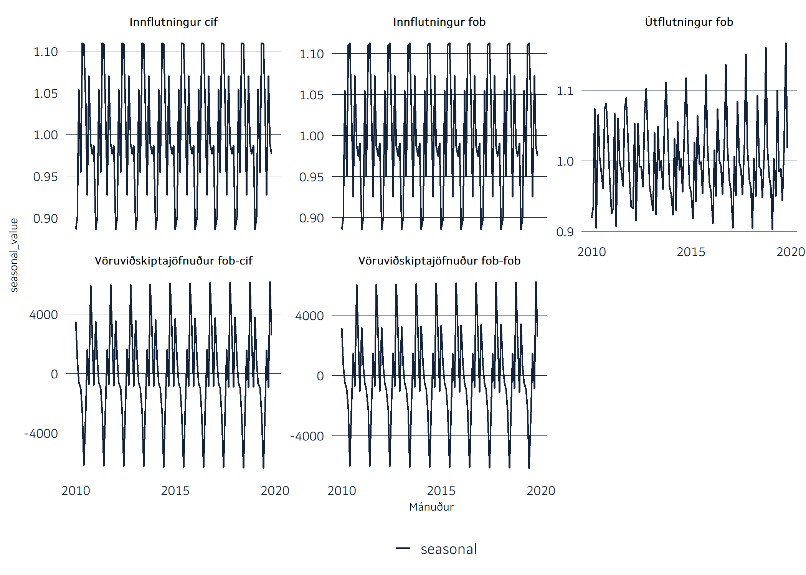

## Dates

The lubriyear converts numeric vector containing years to a date
variable at January first of the corrisponding year:

``` r
x <- tibble(year = 2010:2017)

x %>% 
  mutate(timi = lubriyear(year)) %>% 
  knitr::kable()
```

| year | timi       |
| ---: | :--------- |
| 2010 | 2010-01-01 |
| 2011 | 2011-01-01 |
| 2012 | 2012-01-01 |
| 2013 | 2013-01-01 |
| 2014 | 2014-01-01 |
| 2015 | 2015-01-01 |
| 2016 | 2016-01-01 |
| 2017 | 2017-01-01 |

It also has optional argument, month:

``` r
x %>% 
  mutate(
    month = rep_len(rep(1:12), 8),
    timi = lubriyear(year, month)
    )
```

    ## # A tibble: 8 x 3
    ##    year month timi      
    ##   <int> <int> <date>    
    ## 1  2010     1 2010-01-01
    ## 2  2011     2 2011-02-01
    ## 3  2012     3 2012-03-01
    ## 4  2013     4 2013-04-01
    ## 5  2014     5 2014-05-01
    ## 6  2015     6 2015-06-01
    ## 7  2016     7 2016-07-01
    ## 8  2017     8 2017-08-01

lubriYYYYMM works the same, but is made specially for the MMMMYY
variable from the datawarehouse (and some tables from hagstofan.is):

``` r
lubriYYYYMM("2017M03") %>% 
  knitr::kable()
```

| x          |
| :--------- |
| 2017-03-01 |

## Automated graphics

Here is an example of how to use a automatically updated plotting
functions. The function *yfirverd*, found in *demo\_automation.R*,
prints out a plot and returns the data used:

``` r
df <- yfirverd()
```

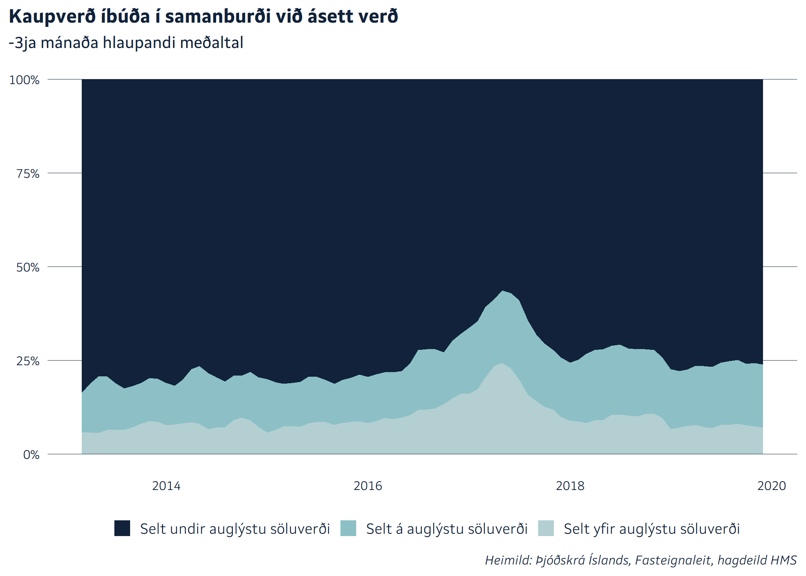

The function *yfirverd* also accepts group variables as an argument:

``` r
df_landshluti <- yfirverd(Landshluti)
```

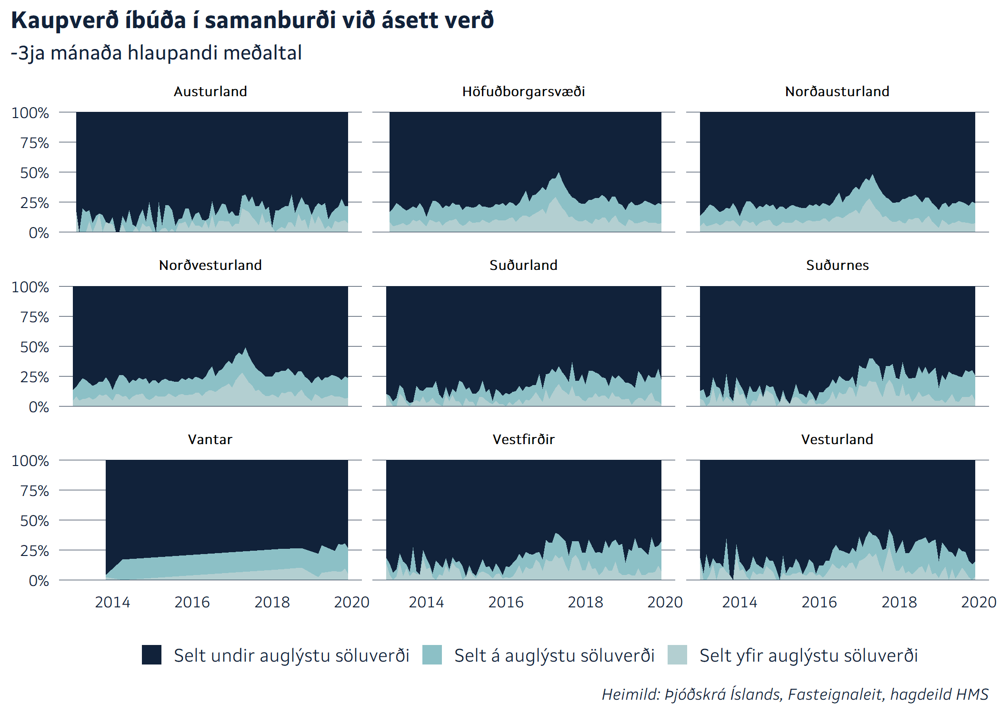

With the argument *eftir* it’s possible to add the names of the groups
to the title:

``` r
df3 <- yfirverd(SerbyliFjolbyli, eftir = "tegund húsnæðis")
```

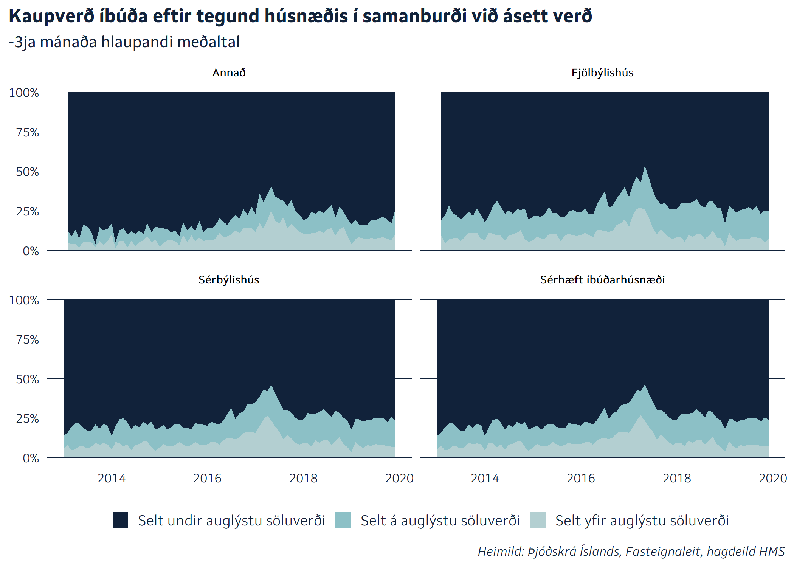

To prevent the plot from printing, set *print\_plot = FALSE*. Then the
function only returns the data used:

``` r
yfirverd(print_plot = FALSE, Landshluti) %>% 
  head() %>% 
  knitr::kable()
```

| timi       | Landshluti       | var                          |       val |
| :--------- | :--------------- | :--------------------------- | --------: |
| 2013-01-01 | Austurland       | Selt yfir auglýstu söluverði |        NA |
| 2013-01-01 | Höfuðborgarsvæði | Selt yfir auglýstu söluverði |        NA |
| 2013-01-01 | Norðausturland   | Selt yfir auglýstu söluverði | 4.0000000 |
| 2013-01-01 | Norðvesturland   | Selt yfir auglýstu söluverði | 3.6666667 |
| 2013-01-01 | Suðurland        | Selt yfir auglýstu söluverði | 0.3333333 |
| 2013-01-01 | Suðurnes         | Selt yfir auglýstu söluverði | 0.3333333 |

This can be helpful, e.g. when making a custumized plot or make further
calculations. It’s also possible to use *plot\_yfirverd* to get the plot
object, but without facets, for better custumizations:

``` r
yfirverd(Landshluti, print_plot = FALSE) %>% 
  plot_yfirverd(title = "This is a title") +
  facet_wrap(~Landshluti, ncol = 2)
```

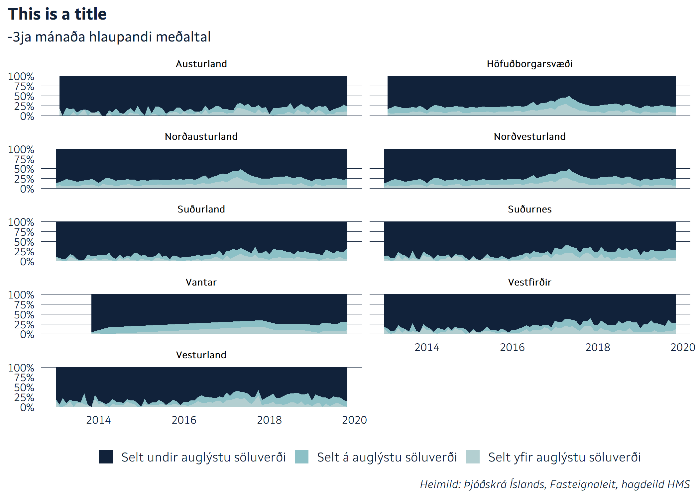 or:

``` r
windowsFonts(Chiller = windowsFont("Chiller"))


yfirverd(Landshluti, print_plot = FALSE) %>% 
  plot_yfirverd(title = "This is a title") +
  facet_wrap(~Landshluti, ncol = 2) +
  scale_fill_viridis_d(option = "C") + 
  theme(
    text = element_text(family = "Chiller"),
    plot.title = element_text(family = "Chiller"),
    plot.subtitle = element_text(family = "Chiller"),
    strip.text = element_text(family = "Chiller"),
    strip.text.x = element_text(family = "Chiller"),
    plot.caption = element_text(family = "Chiller"),
    )
```

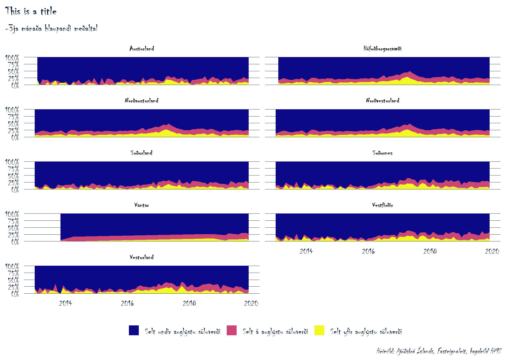

You can add filters to the data with the *filters* argument, but the
filters need to be enclosed in a *quos* function call for it to work.

``` r
df3 <- yfirverd(
  SerbyliFjolbyli, 
  eftir = "tegund húsnæðis", 
  filters = quos(
    SerbyliFjolbyli != "Annað", 
    SerbyliFjolbyli != "Sérhæft íbúðarhúsnæði")
  )
```

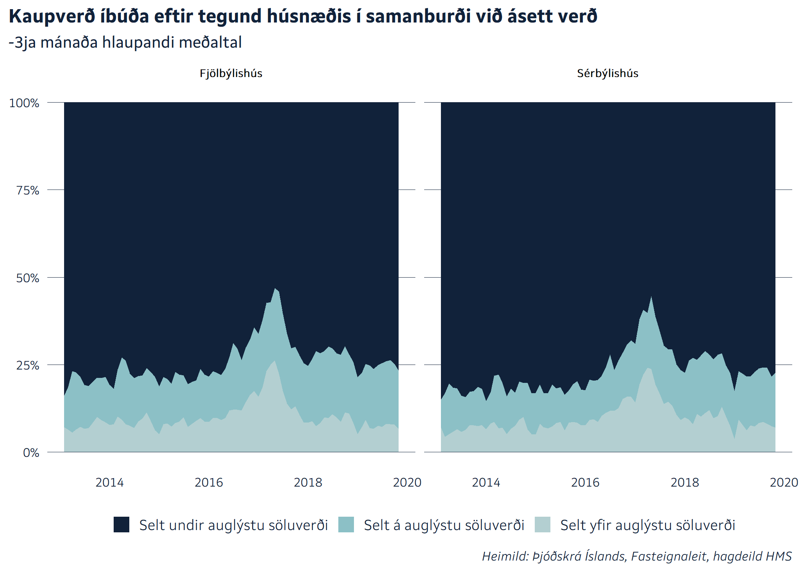

## Saving the graphs

The *save\_both* function from *theme\_hms* is a wrapper for *ggsave*
and saves the last plot, both as *svg* and as a *png* at a specified
size.

``` r
# ggsave_both("yfir")
```

Finally, the function *yfirverd\_get\_data* shows the data that the
function *yfirverd* gets from the datawarehouse.
