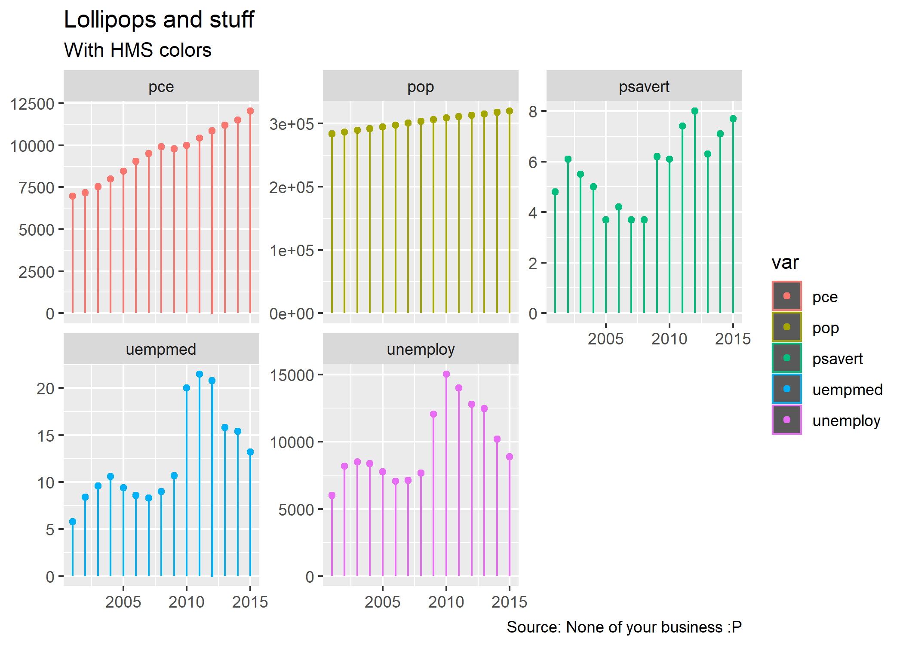
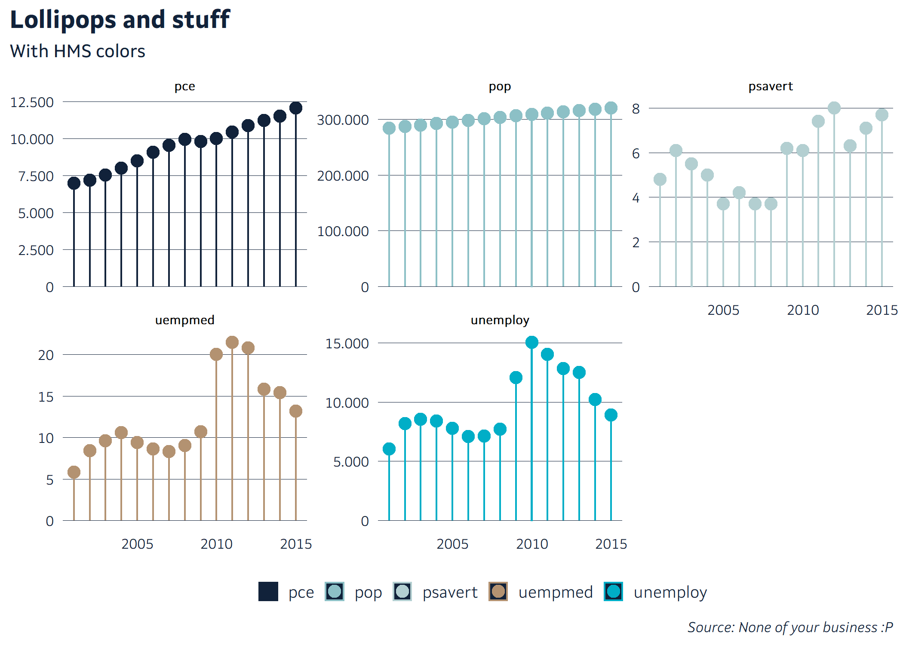

<!-- README.md is generated from README.Rmd. Please edit that file -->

# HMSr

<!-- badges: start -->

<!-- badges: end -->

**NOTE: MOST OF THE FUNCTION HAVE NO PRACTICAL USE OUTSIDE
[HMS](https://www.hms.is/)**

## Installation

You can install the development version from
[GitHub](https://github.com/) with:

``` r
# install.packages("devtools")
remotes::install_github("karsfri/HMSr")
```

## Theme

The default template in ggplot2 is readable, but ugly:

``` r
library(tidyverse)
#> -- Attaching packages ---------------------------------------------------------------------------------------------- tidyverse 1.3.0 --
#> v ggplot2 3.3.0.9000     v purrr   0.3.3     
#> v tibble  2.1.3          v dplyr   0.8.3     
#> v tidyr   1.0.0          v stringr 1.4.0     
#> v readr   1.3.1          v forcats 0.4.0
#> -- Conflicts ------------------------------------------------------------------------------------------------- tidyverse_conflicts() --
#> x dplyr::filter() masks stats::filter()
#> x dplyr::lag()    masks stats::lag()
library(patchwork)
library(lubridate)
#> 
#> Attaching package: 'lubridate'
#> The following object is masked from 'package:base':
#> 
#>     date
library(HMSr)
#> Warning: replacing previous import 'dplyr::intersect' by 'lubridate::intersect'
#> when loading 'HMSr'
#> Warning: replacing previous import 'dplyr::union' by 'lubridate::union' when
#> loading 'HMSr'
#> Warning: replacing previous import 'dplyr::setdiff' by 'lubridate::setdiff' when
#> loading 'HMSr'


data("economics")

economics %>%
  filter(date == lubridate::floor_date(date, "year"), year(date) > 2000) %>%
  gather(var, val, -date) %>%
  ggplot(aes(date, val, color = var)) +
  geom_col(width = 0.3) +
  geom_point() +
  labs(
    title = "Lollipops and stuff",
    subtitle = "With HMS colors",
    x = NULL,
    y = NULL,
    caption = "Source: None of your business :P"
  ) +
  facet_wrap(~var, scales = "free_y")
```



The *theme\_set\_hms()* function sets *theme\_hms* as the default theme,
along with default colors for some of the more popular geoms.

Notice also the helper function, *label\_isl()*.

``` r
theme_set_hms()

economics %>%
  filter(date == lubridate::floor_date(date, "year"), year(date) > 2000) %>%
  gather(var, val, -date) %>%
  ggplot(aes(date, val, color = var)) +
  geom_col(width = 0.3) +
  geom_point() +
  theme_hms() +
  scale_color_manual(values = palette_dark) +
  scale_y_continuous(labels = label_isl()) +
  labs(
    title = "Lollipops and stuff",
    subtitle = "With HMS colors",
    x = NULL,
    y = NULL,
    caption = "Source: None of your business :P"
  ) +
  facet_wrap(~var, scales = "free_y")
```



## Dates

The lubriyear converts numeric vector containing years to a date
variable at January first of the corrisponding year:

``` r
x <- tibble(year = 2002:2017)

x %>% 
  mutate(timi = lubriyear(year)) %>% 
  knitr::kable()
```

| year | timi       |
| ---: | :--------- |
| 2002 | 2002-01-01 |
| 2003 | 2003-01-01 |
| 2004 | 2004-01-01 |
| 2005 | 2005-01-01 |
| 2006 | 2006-01-01 |
| 2007 | 2007-01-01 |
| 2008 | 2008-01-01 |
| 2009 | 2009-01-01 |
| 2010 | 2010-01-01 |
| 2011 | 2011-01-01 |
| 2012 | 2012-01-01 |
| 2013 | 2013-01-01 |
| 2014 | 2014-01-01 |
| 2015 | 2015-01-01 |
| 2016 | 2016-01-01 |
| 2017 | 2017-01-01 |

It also has optional argument, month:

``` r
x %>% 
  mutate(
    month = rep_len(rep(1:12), 16),
    timi = lubriyear(year, month)
    )
#> # A tibble: 16 x 3
#>     year month timi      
#>    <int> <int> <date>    
#>  1  2002     1 2002-01-01
#>  2  2003     2 2003-02-01
#>  3  2004     3 2004-03-01
#>  4  2005     4 2005-04-01
#>  5  2006     5 2006-05-01
#>  6  2007     6 2007-06-01
#>  7  2008     7 2008-07-01
#>  8  2009     8 2009-08-01
#>  9  2010     9 2010-09-01
#> 10  2011    10 2011-10-01
#> 11  2012    11 2012-11-01
#> 12  2013    12 2013-12-01
#> 13  2014     1 2014-01-01
#> 14  2015     2 2015-02-01
#> 15  2016     3 2016-03-01
#> 16  2017     4 2017-04-01
```

lubriYYYYMM works the same, but is made specially for the MMMMYY
variable from the datawarehouse:

``` r
lubriYYYYMM("2017M03") %>% 
  knitr::kable()
```

| x          |
| :--------- |
| 2017-03-01 |
