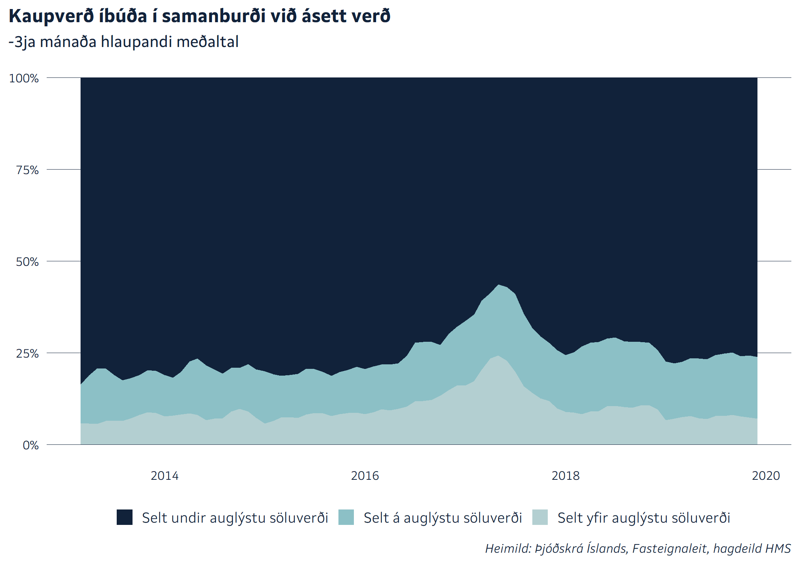
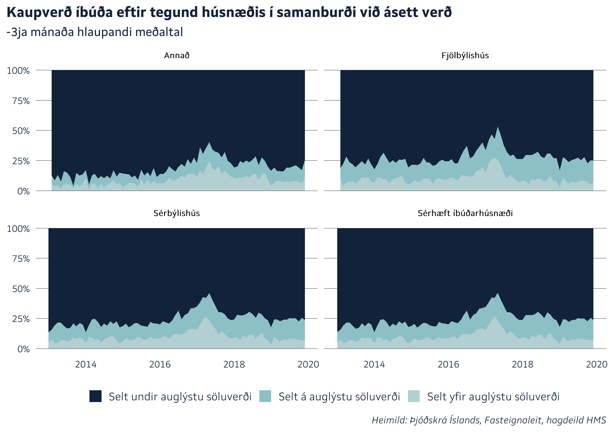
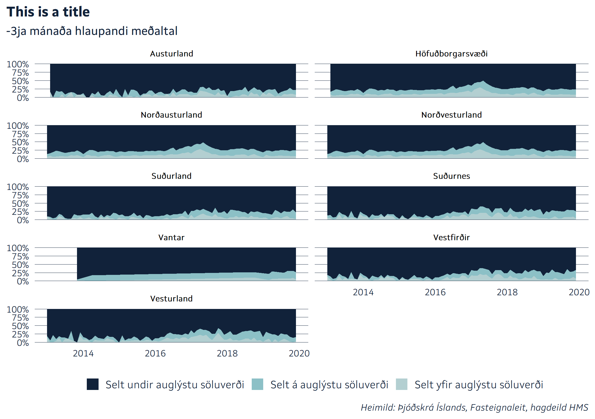
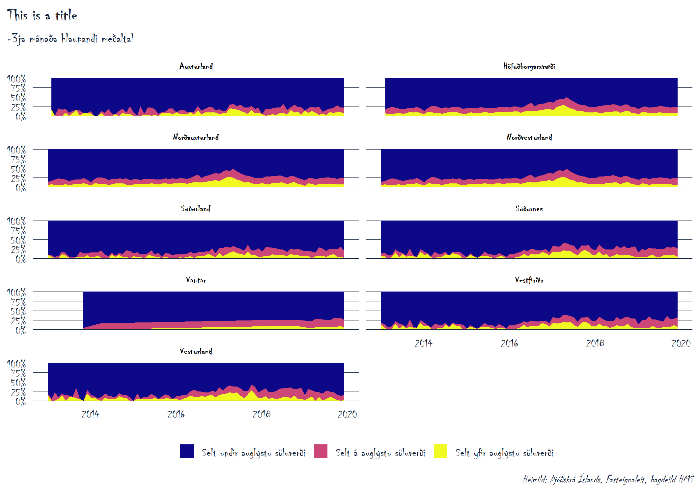
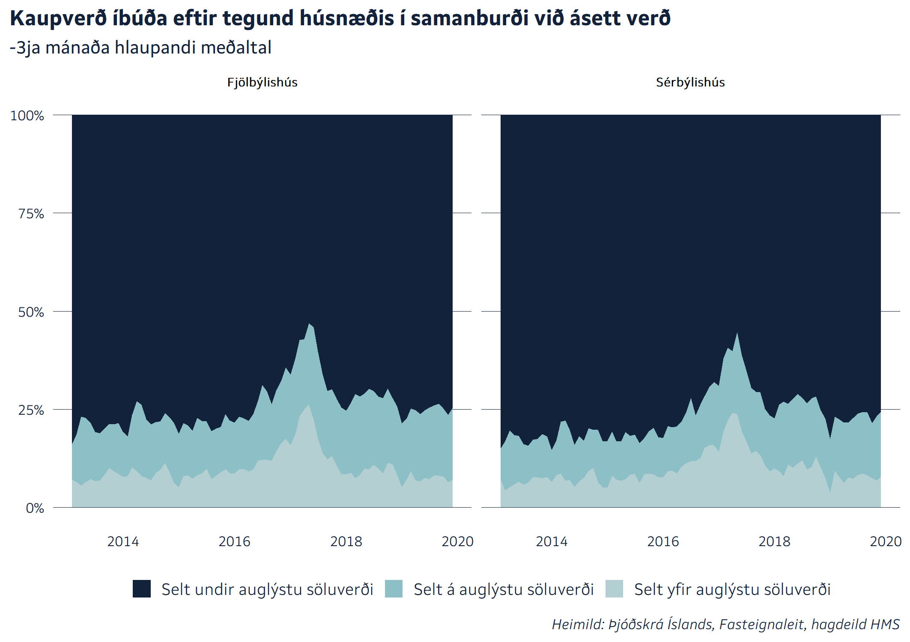

# Example of automated graphics

Here is an example of how to use a automatically updated plotting
functions. The function *yfirverd*, found in *demo\_automation.R*,
prints out a plot and returns the data used:

``` r
df <- yfirverd()
```

<!-- -->

The function *yfirverd* also accepts group variables as an argument:

``` r
df_landshluti <- yfirverd(Landshluti)
```

<!-- -->

With the argument *eftir* it’s possible to add the names of the groups
to the title:

``` r
df3 <- yfirverd(SerbyliFjolbyli, eftir = "tegund húsnæðis")
```

<!-- -->

To prevent the plot from printing, set *print\_plot = FALSE*. Then the
function only returns the data used:

``` r
yfirverd(print_plot = FALSE, Landshluti) %>% 
  head() %>% 
  knitr::kable()
```

| timi       | Landshluti       | var                          |       val |
| :--------- | :--------------- | :--------------------------- | --------: |
| 2013-01-01 | Austurland       | Selt yfir auglýstu söluverði |        NA |
| 2013-01-01 | Höfuðborgarsvæði | Selt yfir auglýstu söluverði |        NA |
| 2013-01-01 | Norðausturland   | Selt yfir auglýstu söluverði | 4.0000000 |
| 2013-01-01 | Norðvesturland   | Selt yfir auglýstu söluverði | 3.6666667 |
| 2013-01-01 | Suðurland        | Selt yfir auglýstu söluverði | 0.3333333 |
| 2013-01-01 | Suðurnes         | Selt yfir auglýstu söluverði | 0.3333333 |

This can be helpful, e.g. when making a custumized plot or make further
calculations. It’s also possible to use *plot\_yfirverd* to get the plot
object, but without facets, for better custumizations:

``` r
yfirverd(Landshluti, print_plot = FALSE) %>% 
  plot_yfirverd(title = "This is a title") +
  facet_wrap(~Landshluti, ncol = 2)
```

<!-- --> or:

``` r
windowsFonts(Chiller = windowsFont("Chiller"))


yfirverd(Landshluti, print_plot = FALSE) %>% 
  plot_yfirverd(title = "This is a title") +
  facet_wrap(~Landshluti, ncol = 2) +
  scale_fill_viridis_d(option = "C") + 
  theme(
    text = element_text(family = "Chiller"),
    plot.title = element_text(family = "Chiller"),
    plot.subtitle = element_text(family = "Chiller"),
    strip.text = element_text(family = "Chiller"),
    strip.text.x = element_text(family = "Chiller"),
    plot.caption = element_text(family = "Chiller"),
    )
```

<!-- -->

You can add filters to the data with the *filters* argument, but the
filters need to be enclosed in a *quos* function call for it to work.

``` r
df3 <- yfirverd(
  SerbyliFjolbyli, 
  eftir = "tegund húsnæðis", 
  filters = quos(
    SerbyliFjolbyli != "Annað", 
    SerbyliFjolbyli != "Sérhæft íbúðarhúsnæði")
  )
```

<!-- -->

## Saving the graphs

The *save\_both* function from *theme\_hms* is a wrapper for *ggsave*
and saves the last plot, both as *svg* and as a *png* at a specified
size.

``` r
# ggsave_both("yfir")
```

Finally, the function *yfirverd\_get\_data* shows the data that the
function *yfirverd* gets from the datawarehouse.

``` r
yfirverd_get_data() %>% 
  head() %>% 
  knitr::kable()
```

| Dim\_Timi\_Utgefid | Dim\_Timi\_Thinglyst | Dim\_Fasteignir | Kaupverd | FjoldiFasteigna | FjoldiMatseininga | AuglystDags | AuglystSoluverd | Landshluti       | Landshlutaflokkun          | HofudborgLandsbyggd | SerbyliFjolbyli | FjoldiHerbergja | SeltYfirAuglystuSoluverdi | SeltAAuglystuSoluverdi | SeltUndirAuglystuSoluverdi | LOAD\_DATE | RECORD\_SOURCE | ETL\_ID |
| :----------------- | :------------------- | --------------: | -------: | --------------: | ----------------: | :---------- | --------------: | :--------------- | :------------------------- | :------------------ | :-------------- | --------------: | ------------------------: | ---------------------: | -------------------------: | :--------- | -------------: | ------: |
| 2013-01-01         | 2013-01-21           |          303570 | 14000000 |               1 |                 1 | NA          |              NA | Höfuðborgarsvæði | Höfuðborgarsvæði           | Höfuðborgarsvæði    | Fjölbýlishús    |               2 |                        NA |                     NA |                         NA | 2020-01-28 |              1 |    2313 |
| 2013-01-01         | 2013-02-22           |          208252 |  6000000 |               1 |                 3 | NA          |              NA | Suðurnes         | Nágrenni höfuðborgarsvæðis | Landsbyggð          | Sérbýlishús     |               5 |                        NA |                     NA |                         NA | 2020-01-28 |              1 |    2313 |
| 2013-01-02         | 2013-01-10           |          271034 | 54000000 |               1 |                 2 | 2012-11-29  |        55900000 | Höfuðborgarsvæði | Höfuðborgarsvæði           | Höfuðborgarsvæði    | Fjölbýlishús    |               3 |                         0 |                      0 |                          1 | 2020-01-28 |              1 |    2313 |
| 2013-01-02         | 2013-01-10           |          115623 | 20400000 |               1 |                 2 | 2012-12-11  |        20900000 | Höfuðborgarsvæði | Höfuðborgarsvæði           | Höfuðborgarsvæði    | Fjölbýlishús    |               5 |                         0 |                      0 |                          1 | 2020-01-28 |              1 |    2313 |
| 2013-01-02         | 2013-01-07           |          147967 | 18700000 |               1 |                 1 | 2012-10-03  |        18900000 | Höfuðborgarsvæði | Höfuðborgarsvæði           | Höfuðborgarsvæði    | Fjölbýlishús    |               2 |                         0 |                      0 |                          1 | 2020-01-28 |              1 |    2313 |
| 2013-01-02         | 2013-01-11           |           76927 | 40000000 |               1 |                 2 | 2012-07-11  |        38000000 | Höfuðborgarsvæði | Höfuðborgarsvæði           | Höfuðborgarsvæði    | Fjölbýlishús    |               2 |                         1 |                      0 |                          0 | 2020-01-28 |              1 |    2313 |
